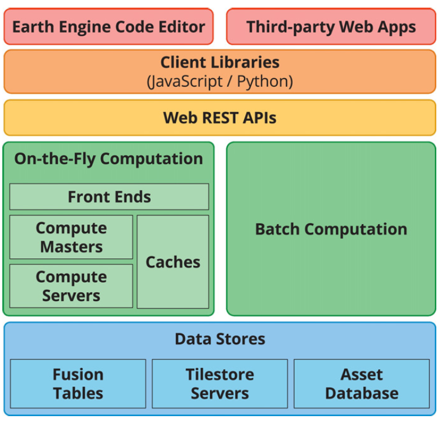
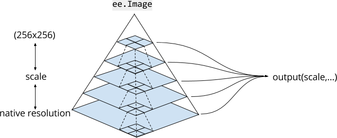
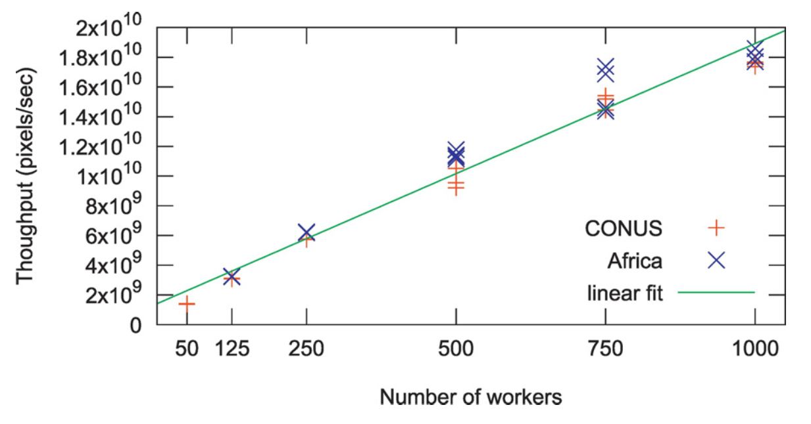

2018-02-28 - Basel, Switzerland - Using earth observation (EO) data products for environmental exposure assessment

## Outline

1. What is Google Earth Engine?
2. Datasets
3. Uploading data
4. Processing data

## What is Google Earth Engine?

"A cloud-based platform for planetary-scale geospatial analysis""

1. Datasets stored in Google datacenters
2. Compute power in those datacenters
3. Tools to disseminate results

"Letting scientists focus on science instead of downloading and managing data"

## Examples

[Timelapse](https://earthengine.google.com/timelapse/)

[Global Forest Change](http://earthenginepartners.appspot.com/science-2013-global-forest)

[Global Surface Water Occurrence](https://global-surface-water.appspot.com/)

## Architecture {.smaller }

<div class="columns-2">
```{r, echo = FALSE, out.width = 480}

```



</br>

Gorelick, N., Hancher, M., Dixon, M., Ilyushchenko, S., Thau, D., & Moore, R. (2017). Google Earth Engine: Planetary-scale geospatial analysis for everyone. Remote Sensing of Environment, 202, 18-27. https://doi.org/10.1016/j.rse.2017.06.031
</div>

## Scaling {.smaller}

```{r, echo = FALSE, out.height = 450}

```

Gorelick, N., Hancher, M., Dixon, M., Ilyushchenko, S., Thau, D., & Moore, R. (2017). Google Earth Engine: Planetary-scale geospatial analysis for everyone. Remote Sensing of Environment, 202, 18-27. https://doi.org/10.1016/j.rse.2017.06.031

## Suitability

Good for

* Per-pixel operations
* Finite neighborhood operations
* Time series statistics (streaming)

Bad for

* Operations where local value can be influenced by distant values (watershed analysis, classical clustering algorithms)
* Operations that require lots of data on hand (training classical machine learning models)
* Long-running iterative processes (agent-based models, finite element analysis)
* Data-intensitve models using data not already in Earth Engine

## Datasets

https://earthengine.google.com/datasets/

## Explorer

https://explorer.earthengine.google.com/

## Code Editor

https://code.earthengine.google.com/

The [example script](https://code.earthengine.google.com/?accept_repo=users/ihough/france_landsat_ndvi)

```
git clone https://earthengine.googlesource.com/users/ihough/france_landsat_ndvi
```


## Documentation

https://developers.google.com/earth-engine/
